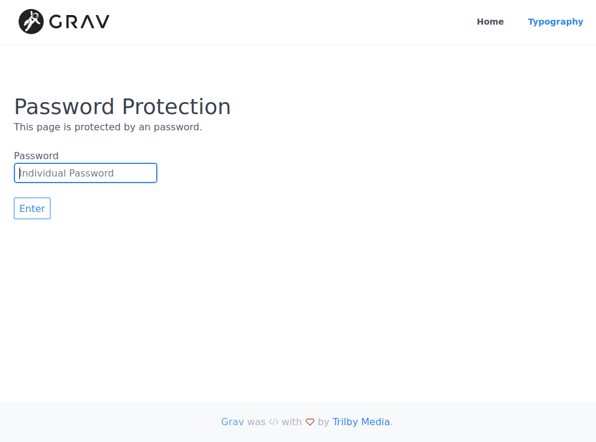
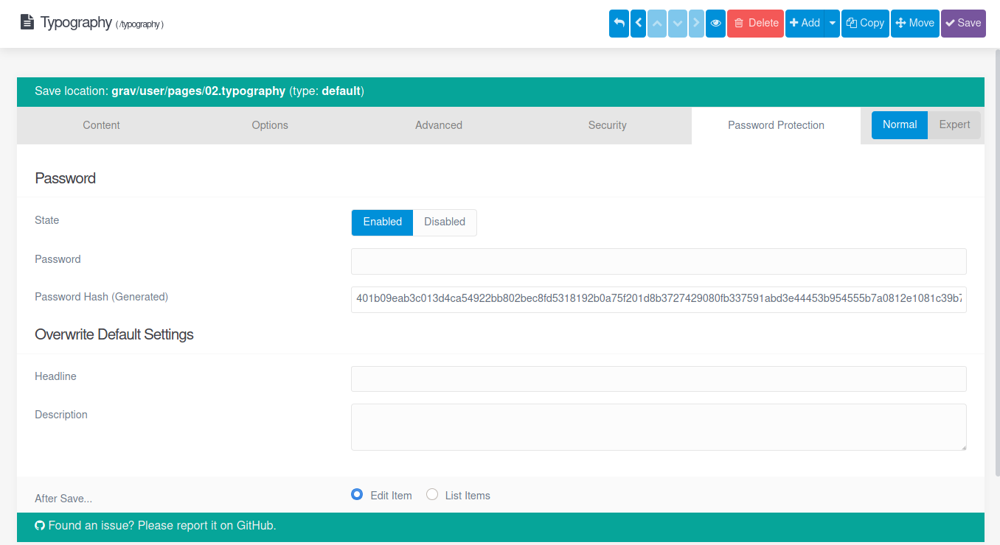

# Password protection for GravCMS
Password protection is a simple plugin which allows you to specify a uniqe password for a page. Every page can have a different password.


## Usage
After the installation you will find an extra tab on the pages. There you can `enable` the plugin for this specific page and set the unique password.  
There is no default password!

**NOTE:** The password is automatically converted to a `SHA512` hash.



## Installation

Installing the **Password Protection** plugin can be done in one of three ways: The GPM (Grav Package Manager) installation method lets you quickly install the plugin with a simple terminal command, the manual method lets you do so via a zip file, and the admin method lets you do so via the Admin Plugin.

### GPM Installation (Preferred)

To install the plugin via the [GPM](http://learn.getgrav.org/advanced/grav-gpm), through your system's terminal (also called the command line), navigate to the root of your Grav-installation, and enter:

    bin/gpm install password-protection

This will install the Simple Cookie plugin into your `/user/plugins`-directory within Grav. Its files can be found under `/your/site/grav/user/plugins/password-protection`.

### Manual Installation

To install the plugin manually, download the zip-version of this repository and unzip it under `/your/site/grav/user/plugins`. Then rename the folder to `password-protection`. You can find these files on [GitHub](https://github.com/tomschwarz/grav-plugin-password-protection) or via [GetGrav.org](http://getgrav.org/downloads/plugins#extras).

You should now have all the plugin files under

    /your/site/grav/user/plugins/password-protection


### Admin Plugin

If you use the Admin Plugin, you can install the plugin directly by browsing the `Plugins`-menu and clicking on the `Add` button.

## Configuration

Before configuring this plugin, you should copy the `user/plugins/password-protection/password-protection.yaml` to `user/config/plugins/password-protection.yaml` and only edit that copy.

Here is the default configuration:

```yaml
enabled: true
active: true
headline: 'Password Protection'
description: 'This page is protected by an password.'
hint: 'Maybe the default password or a random one?'
password_label: Password
password_placeholder: Password
submit_label: Enter
```

The options should be self-explain.  
Note that if you use the Admin Plugin, a file with your configuration named `password-protection.yaml` will be saved in the `user/config/plugins/`-folder once the configuration is saved in the Admin.

### Pages configuration

Once installed, on the pages itself you can `enable` it for current page and specify the `password` for it.

Optional you can overwrite the default `Headline` and `Description`.

If you have the Admin Plugin installed you are able to configure it over the Page itself.
There is a new tab `Password Protection` which contain all available options.

Here is a list of all available options for an page:

```yaml
# Enable or disable the password protection for this site
# 1 = Enabled
# 0 = Disabled
pp_protect: '1'

# Contains the SHA512 hash
# - If you use the Admin-Plugin the hash will be automatically generated on saving.
# - If you use it without the Admin-Plugin you have to generate the hash by yourself.
pp_password_hash: [HASH]

# Overwrite's the default headline
pp_headline: 'My custom headline.'

# Overwrite's the default description
# Multiline is possible
pp_description: "My custom \r\nmultilne description."
```

## Contributing

If you want to contribute create an issue or an pull request.  
I appreciate every single help!

## Other

If you got some problems, improvements or changes let me know.  
